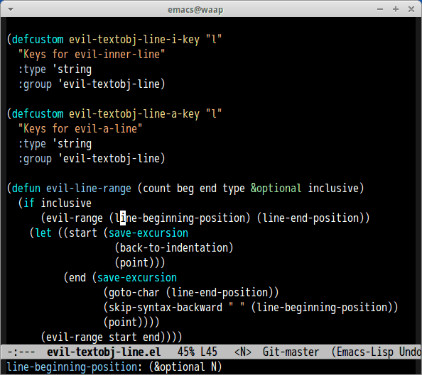

# evil-textobj-line

This package is Emacs port of [vim-textobj-line](https://github.com/kana/vim-textobj-line).

## Screencast

Demo of `vil` and `val` keys.

## Customize variable

#### `evil-textobj-line-i-key`(Default: `"l"`)

Keys for `evil-inner-line`.

#### `evil-textobj-line-a-key`(Default: `"l"`)

Keys for `evil-a-line`
